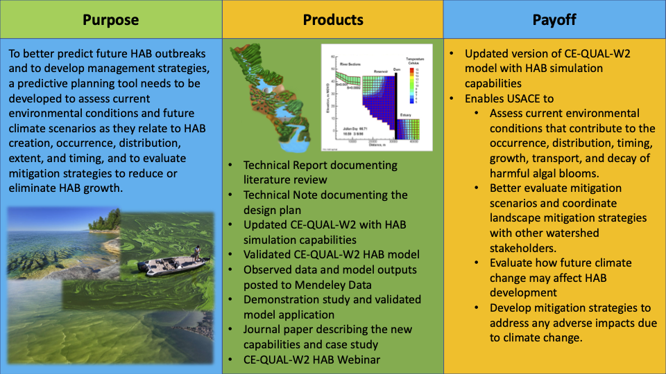

# Development of a Predictive HAB Planning Tool using CE-QUAL-W2

## Problem

Harmful Algal Blooms (HABs) are a critical national issue, degrading water quality, endangering aquatic ecosystems, and posing health risks. Current models inadequately predict HAB timing, frequency, intensity, and impacts, which are exacerbated by climate change. USACE is tasked by the 2018 WRDA to develop tools for HAB detection, prevention, and management. An enhanced CE-QUAL-W2 model with HAB capabilities is needed for to develop effective management and mitigation strategies. 

## Objective

Develop and demonstrate a HAB planning tool using CE-QUAL-W2 to better predict future HAB outbreaks and to develop management strategies. This predictive planning tool will be able to assess current environmental conditions and future climate scenarios as they relate to HAB creation, occurrence, distribution, extent, and timing, and to evaluate mitigation strategies to reduce or eliminate HAB growth.

## Approach

The CE-QUAL-W2 model will be updated to incorporate the latest research on the physical and biological dynamics of HABs. The team will then rigorously test and validate the enhanced model through a coordinated demonstration study with USACE field partners, employing robust statistical measures to ensure its efficacy in simulating HABs. Upon validation, the updated model will be published on GitHub and introduced to USACE staff via a webinar, ensuring broad dissemination and technical transfer.

## Milestones

| Deliverable    | Description                                                                                                                                     |
|----------------|-------------------------------------------------------------------------------------------------------------------------------------------------|
| Publications   | Tech Report. Summers et al., 2024 Current Capabilities and Opportunities for Numerical Water Quality Modeling of Harmful Algae Blooms (In prep) |
|                | Tech Note. Steissberg et al., 2024. Development of a Predictive HAB Planning Tool using CE-QUAL-W2 (In prep)                                    |
|                | Journal Article. Steissberg et al., 2025. A Predictive Harmful Algal Bloom Planning Tool using CE-QUAL-W2 (In prep)                             |
| Products       | Updated and validated CE-QUAL-W2 with HAB capabilities distributed via GitHub repository                                                        |
|                | Updated CE-QUAL-W2 User's Manual posted to GitHub repository                                                                                    |
|                | Detroit Lake HAB case study model and observed data, posted to Mendeley Data                                                                    |
| Demonstrations | Webinar demonstrating the CE-QUAL-W2 HAB capabilities                                                                                           |

## Partnership/Leveraging Opportunities

This work leverages the previous ANSRP project "Operational Strategies for HABs Management in Inland Reservoirs" and will be conducted in coordination with "Improved Harmful Algal Blooms Prediction with Hybrid Models" led by Dr. Jodi Ryder. This project is partnering with NWD/NWP, developing a case study of Detroit Lake, Oregon.

## Value to USACE mission

The new Harmful Algal Bloom simulation capabilities of CE-QUAL-W2 will advance USACE's ability to understand and manage HABs by enabling a comprehensive assessment of the current environmental conditions that are conducive to the emergence, spread, timing, proliferation, movement, and decline of HABs. This project will improve the USACE's capacity to evaluate various mitigation scenarios and collaborate with other stakeholders within the watershed to coordinate broad-scale mitigation efforts. It will also be instrumental in predicting the potential impacts of future climatic changes on the formation and intensity of HABs. USACE staff can then develop and implement targeted mitigation strategies to preserve ecological balance and protect water quality.

|  |
| -- |
| Graphical Abstract |
